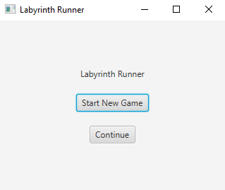
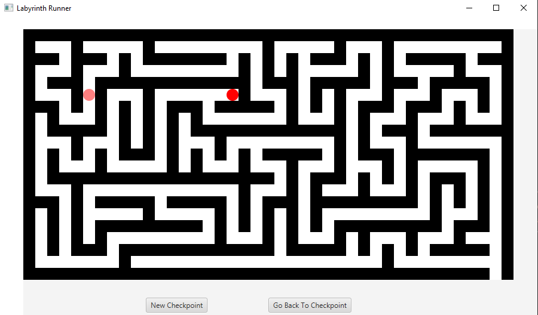
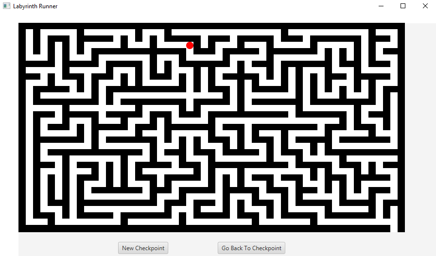

# Labyrinth Runner

## Contents

- Introduction
- Presentation
- Requirements
- Installation
- Troubleshooting
- Maintainers

## Introduction

Labyrinth Runner is a demo of a game in which you as a player have to move your
object from the starting point to the exit of a labyrinth. At every point of a game you 
can set a checkpoint to which you will be able to return. 
Successful exit from a labyrinth spawns you at the beginning of a new one, with each 
new labyrinth, the complexity of it raises. Every new labyrinth is random-generated.
After exiting and restarting whole game, you will have a chance to continue from where you left off.

## Presentation

First labyrinth:

Fourth labyrinth:

## Requirements

- OpenJDK ver.21 or higher

## Installation

**Cloning Repository Steps:**
- Open your IntelliJ IDE
- Go to file/new/project_from_version_control
- Paste URL: https://github.com/Alex555eu/labyrinth_runner.git
- Clone repository
- Compile and run

## Troubleshooting

**Symptoms**
- Not being able to start a game by using 'Continue' button.

**Possible Causes**
- 'Continue' button starts the game from last saved state, which is created after closing 
the game. Error occurs when we start a game for the first time since cloning it into our machine.

**Troubleshooting**
- Try turning the game off and on again.

## Maintainers

Current maintainers:
- Aleksander Pasich ([@github](https://github.com/Alex555eu))